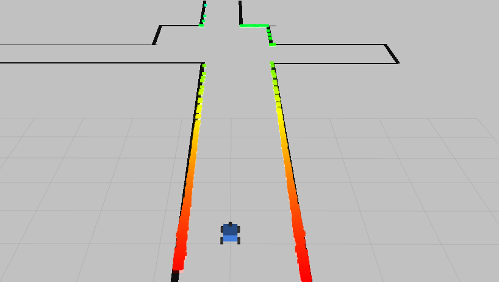
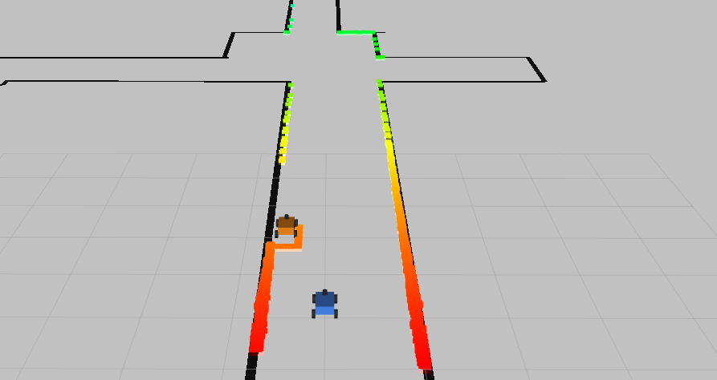

# F1TENTH Simulator

A high-performance F1/10 autonomous racing simulator with ROS2 integration, featuring realistic vehicle dynamics, laser scanning, and collision detection.



## Features

- **Realistic Physics**: Single-track dynamic model with RK4/Euler integration
- **2D LiDAR Simulation**: Ray-casting based laser scan with 1080 beams
- **Collision Detection**: Time-to-collision (TTC) based safety system
- **ROS2 Integration**: Full support for ROS2 Humble with RViz visualization
- **Multiple Maps**: Includes Levine, Vegas, Berlin, Skirk, and custom map support
- **Multi-Agent Support**: Up to 2 agents in the same environment
- **NumPy 1.26 Compatible**: Updated for the latest scientific computing stack

## Prerequisites

- **Ubuntu 22.04** (or compatible Linux distribution)
- **Python 3.10+**
- **ROS2 Humble** (for ROS integration)
- **NumPy 1.26.0**
- **OpenGL support** (for visualization)

## Installation

### 1. Install System Dependencies

```bash
# ROS2 Humble (if not already installed)
sudo apt install ros-humble-desktop ros-humble-ackermann-msgs ros-humble-nav2-map-server

# Python dependencies
sudo apt install python3-pip python3-dev
```

### 2. Install OpenAI Gym (Base Library)

The simulator uses OpenAI Gym 0.19.0 as its foundation:

```bash
cd /path/to/your/workspace/src/f1tenth_simulator/gym
pip install -e .
```

This installs the base gym library with numpy 1.26 support.

### 3. Install F110 Gym (Simulator Core)

Install the F1/10 specific gym environment:

```bash
cd /path/to/your/workspace/src/f1tenth_simulator/f1tenth_gym
pip install -e .
```

This will automatically install dependencies:
- `numpy~=1.26.0` (updated for latest compatibility)
- `gym==0.19.0` (from step 2)
- `Pillow>=9.0.1`
- `scipy>=1.7.3`
- `numba>=0.55.2`
- `pyyaml>=5.3.1`
- `pyglet<1.5`
- `pyopengl`

### 4. Build ROS2 Packages

```bash
cd /path/to/your/workspace
sudo apt update
rosdep install --from-paths src/f1tenth_simulator --ignore-src -r -y
colcon build --symlink-install

# Source the workspace
source install/setup.bash
```

**Note**: The `--symlink-install` flag allows you to modify Python files without rebuilding.

## Running the Simulator

### Launch ROS2 Simulator with RViz

```bash
cd /path/to/your/workspace
source install/setup.bash
ros2 launch f1tenth_gym_ros gym_bridge_launch.py
```

This will start:
- **gym_bridge**: Physics simulation node
- **RViz2**: Visualization
- **map_server**: Map publishing for visualization
- **robot_state_publisher**: TF transforms

### Control the Car

**Option 1: Keyboard Teleop (Recommended)**

In a new terminal:

```bash
source install/setup.bash
ros2 run teleop_twist_keyboard teleop_twist_keyboard
```

**Controls:**
- `i` - Move forward
- `,` - Move backward
- `j` - Turn left
- `l` - Turn right
- `k` - Stop
- `q/z` - Increase/decrease speeds

**Option 2: Direct Topic Publishing**

```bash
# Drive forward at 2 m/s
ros2 topic pub /cmd_vel geometry_msgs/msg/Twist "{linear: {x: 2.0}, angular: {z: 0.0}}" --once

# Drive and turn left
ros2 topic pub /cmd_vel geometry_msgs/msg/Twist "{linear: {x: 2.0}, angular: {z: 1.0}}" --once

# Stop
ros2 topic pub /cmd_vel geometry_msgs/msg/Twist "{linear: {x: 0.0}, angular: {z: 0.0}}" --once
```

**Option 3: Ackermann Drive Commands**

```bash
# Direct Ackermann control (speed in m/s, steering in radians)
ros2 topic pub /ego_racecar/drive ackermann_msgs/msg/AckermannDriveStamped \
  "{drive: {speed: 2.0, steering_angle: 0.3}}" --rate 10
```

## Configuration

### Changing Maps

Edit `f1tenth_gym_ros/config/sim.yaml`:

```yaml
bridge:
  ros__parameters:
    map_path: 'levine'  # Options: 'levine', 'square', 'vegas', 'berlin', 'skirk', 'Spielberg_map'
    map_img_ext: '.png'
```

Available maps:
- **levine**: Complex indoor environment
- **square**: Simple square track
- **vegas**: Race track layout
- **berlin**: City street circuit
- **skirk**: Technical course
- **Spielberg_map**: F1-style circuit

### Adjusting Starting Position

Edit `f1tenth_gym_ros/config/sim.yaml`:

```yaml
bridge:
  ros__parameters:
    # Ego car starting pose (in meters and radians)
    sx: 0.0
    sy: 0.0
    stheta: 0.0
    
    # Opponent starting pose (if num_agent: 2)
    sx1: 2.0
    sy1: 0.5
    stheta1: 0.0
```

### Multi-Agent Racing



To enable a second agent (opponent car):

```yaml
bridge:
  ros__parameters:
    num_agent: 2  # Change from 1 to 2
```

**Visualization**: The launch file automatically switches to `gym_bridge_dual.rviz` when `num_agent: 2`, which displays:
- Both cars' robot models
- Both cars' laser scans (ego in rainbow colors, opponent in red)
- All TF frames for both agents

No need to rebuild - just change the config and relaunch!

## Python API Usage

You can also use the gym environment directly in Python:

```python
import gym
import numpy as np

# Create environment
env = gym.make('f110_gym:f110-v0', 
               map='levine',  # or full path
               map_ext='.png',
               num_agents=1)

# Reset
obs, _, _, _ = env.reset(np.array([[0.0, 0.0, 0.0]]))

# Step simulation
for i in range(100):
    # action: [steering_angle, velocity]
    obs, reward, done, info = env.step(np.array([[0.0, 2.0]]))
    
    if obs['collisions'][0]:
        print("Collision detected!")
        break
```

## Visualization in RViz

The RViz window displays:
- **Map**: Gray occupancy grid showing the track
- **LaserScan**: Rainbow-colored points showing obstacle detection
  - Red/Orange: Close obstacles
  - Green/Yellow: Medium distance
  - Blue/Purple: Far obstacles
- **RobotModel**: 3D visualization of the F1/10 car
- **TF frames**: Coordinate transforms

## Troubleshooting

### Safely Ignore, will be patched in the future
```
[ERROR] [1762497570.014066382] [rviz2]: Vertex Program:rviz/glsl120/indexed_8bit_image.vert Fragment Program:rviz/glsl120/indexed_8bit_image.frag GLSL link result : 
[rviz2-1] active samplers with a different type refer to the same texture image unit
```
### Car Drives Through Walls

This was a known issue that has been fixed in this version. The problem was:
- PNG maps are RGBA (4-channel), not grayscale
- The distance transform wasn't converting RGBA to grayscale
- Fixed by adding RGB to grayscale conversion in laser_models.py

### Map Not Displaying in RViz

- Ensure map_server started successfully: Check for "Managed nodes are active" in logs
- Verify RViz is subscribed to `/map` topic: `ros2 topic info /map`
- The GLSL shader error is a graphics driver warning and can be ignored

### Import Errors

If you see `ModuleNotFoundError: No module named 'f110_gym'`:
```bash
cd f1tenth_gym
pip install -e .
```

### NumPy Version Conflicts
If `pip check` shows `f110-gym requires numpy<=1.22.0 but you have numpy 1.26.0`:

```bash
# Reinstall f110-gym to update pip's metadata
cd /path/to/workspace/src/f1tenth_simulator/f1tenth_gym
pip uninstall -y f110_gym
pip install --user -e .
```

This updates pip's database with the new numpy~=1.26.0 requirement.

If you need to upgrade numpy:
```bash
pip install --upgrade numpy==1.26.0
```

## Technical Details

### Collision Detection

Uses instant Time-to-Collision (iTTC) algorithm:
- Threshold: 0.005 seconds
- At 3 m/s: collision triggers within ~1.5cm of obstacles
- Ensures realistic racing dynamics

### Physics

- **Vehicle Model**: Single-track dynamic model
- **Integration**: RK4 (4th-order Runge-Kutta) by default
- **Timestep**: 0.01s (100 Hz)
- **State**: [x, y, steering_angle, velocity, yaw, yaw_rate, slip_angle]

### LiDAR

- **Beams**: 1080
- **FOV**: 4.7 radians (~270°)
- **Range**: 0-30 meters
- **Noise**: Gaussian with σ=0.01m

## Topics

### Published

- `/ego_racecar/scan` (sensor_msgs/LaserScan): Laser scan data
- `/ego_racecar/odom` (nav_msgs/Odometry): Odometry
- `/map` (nav_msgs/OccupancyGrid): Map for visualization

### Subscribed

- `/cmd_vel` (geometry_msgs/Twist): Velocity commands (if kb_teleop enabled)
- `/ego_racecar/drive` (ackermann_msgs/AckermannDriveStamped): Drive commands
- `/initialpose` (geometry_msgs/PoseWithCovarianceStamped): Reset ego pose
- `/goal_pose` (geometry_msgs/PoseStamped): Reset opponent pose (if 2 agents)
