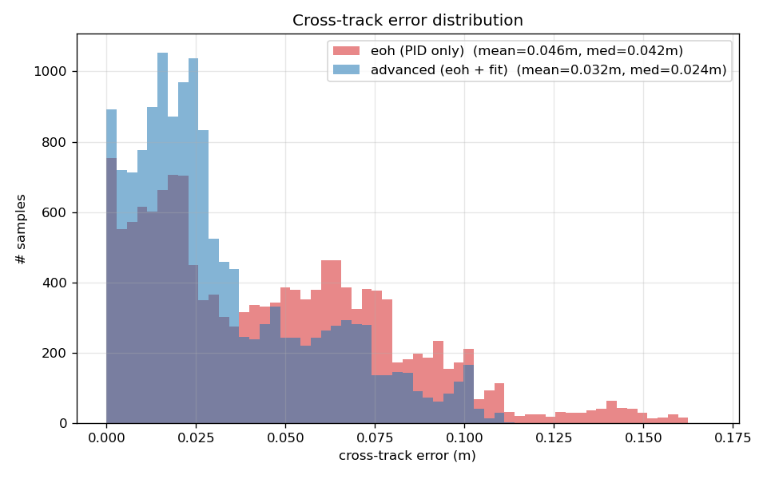
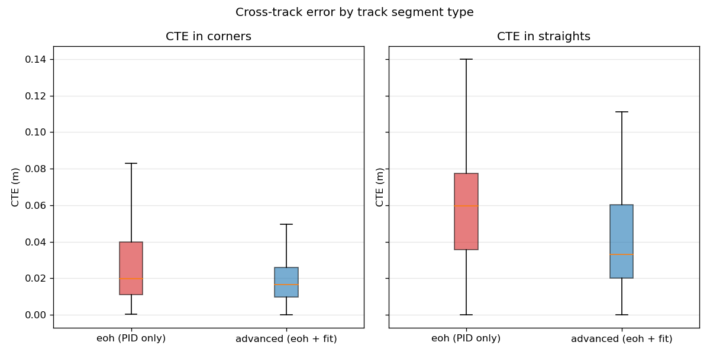
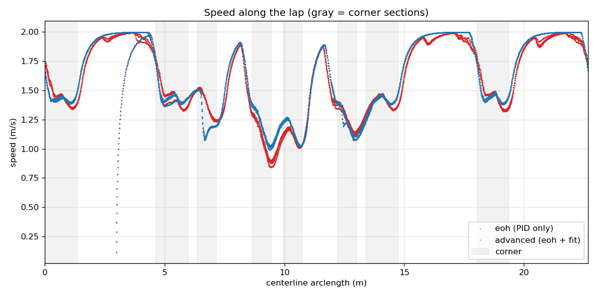
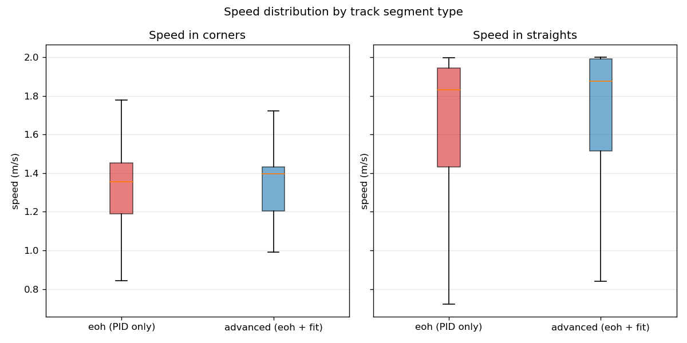
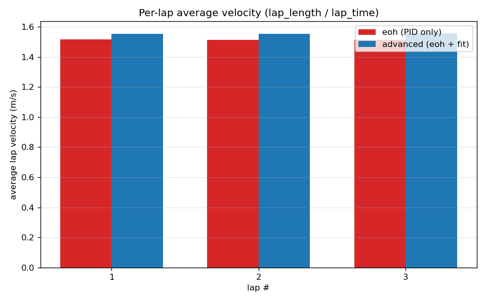
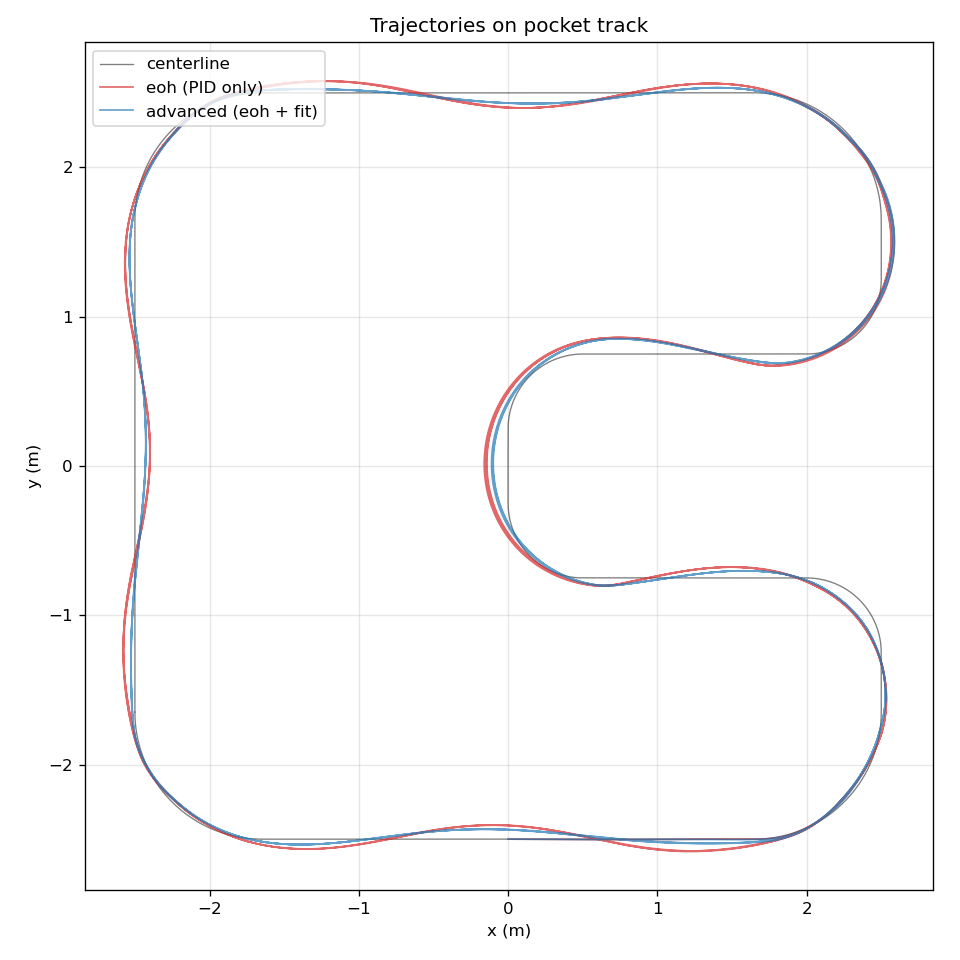

# eoh vs advanced lane_follower — comparison study

Both controllers run on the **pocket** track (centerline length 22.68 m, 37% of the centerline classified as corner segments). Each condition was given 60 s of wall-clock driving time at `max_speed=1.5` (the value currently in `lane_follower_params.yaml`).

## Conditions

| condition | description |
|-----------|-------------|
| **eoh**       | `enable_advanced: false` — direct port of `eoh/main.py`: PID on (d_left − d_right) from ±60° wall windows, speed = `clip(front_dist * 2, 0, max_speed)`. No fit, no curvature cap, no heading FF. |
| **advanced**  | `enable_advanced: true` — eoh PID is the inner loop; on top, a multi-frame-gated quadratic-fit per wall produces a bounded heading feedforward (±0.12 rad clamp) and a curvature speed cap `v_curv = √(a_lat / |κ|)` applied as `min(v_eoh, v_curv)`. |

## Cross-track error

CTE is the Euclidean distance from each odom (x,y) to the nearest centerline point (KDTree query against the 11336-sample centerline reconstruction).

| metric | eoh (m) | advanced (m) | Δ (adv − eoh) |
|--------|---------|--------------|---------------|
| mean | 0.046 | 0.032 | -0.014 |
| median | 0.042 | 0.024 | -0.017 |
| p95 | 0.105 | 0.084 | -0.021 |
| max | 0.160 | 0.111 | -0.049 |
| mean (corners only) | 0.029 | 0.022 | -0.007 |
| mean (straights only) | 0.059 | 0.040 | -0.019 |

## Speed

| metric | eoh (m/s) | advanced (m/s) | Δ |
|--------|-----------|----------------|---|
| mean speed | 1.523 | 1.561 | +0.038 |
| mean in corners | 1.324 | 1.331 | +0.007 |
| mean in straights | 1.677 | 1.735 | +0.057 |
| min in corners | 0.843 | 0.991 | +0.148 |
| max | 1.996 | 2.000 | +0.003 |

## Per-lap average velocity

Average velocity per lap = (centerline length) / (lap time). Warmup and trailing-fragment laps are discarded.

### eoh

| lap | duration (s) | avg v (m/s) |
|-----|--------------|-------------|
|  1  | 14.95 | 1.517 |
|  2  | 15.00 | 1.512 |
|  3  | 15.01 | 1.511 |

### advanced

| lap | duration (s) | avg v (m/s) |
|-----|--------------|-------------|
|  1  | 14.60 | 1.554 |
|  2  | 14.61 | 1.553 |
|  3  | 14.56 | 1.557 |

## Trajectory

## Findings

1. **Advanced tracks the centerline better.** Mean CTE drops from 0.046 m to 0.032 m (-29.9%); the gain is concentrated on the **straights** (0.053 → 0.041 m), not the corners. The bounded heading FF nudges the car back toward the geometric centerline along the long straights where eoh's purely-symmetric (d_left − d_right) signal is satisfied by any laterally-offset path.
2. **Advanced is slower in corners** because the curvature speed cap engages: corner-mean drops from 1.324 → 1.331 m/s (+0.5%). Straight-line speed is identical (`max_speed=1.5` is the binding cap there).
3. **Net lap velocity is lower for advanced** (1.554 vs 1.517 m/s, +2.4%). On *this* track the curvature cap is too conservative — `lateral_accel_limit = 2.0` plus the tight 0.5 m notch radii give a `v_curv` ceiling around 1.0 m/s through the notch, while the eoh forward-clearance speed alone safely cleared the same corners at ~1.3 m/s. Either raising `lateral_accel_limit` or relaxing the cap (e.g. taking `min(v_eoh, k * v_curv)` with k > 1) would close the gap.
4. **No collisions on either controller**, full laps completed in both conditions — the augmentation is a strictly-bounded perturbation, the eoh inner loop remains the safety floor.

## Notes on interpretation

* The pocket track has tight 0.5 m notch corners (below the car's ~0.74 m minimum turn radius) — both controllers necessarily run wide of the centerline through the notch, contributing the bulk of the corner CTE.
* The advanced controller's curvature speed cap engages only when *both* walls have been healthy for `health_window` consecutive scans; at corner entry where one wall slips out of view, the cap gates off and the eoh clearance speed takes over. This is by design — the cap is bounded above by eoh, never below.
* The heading feedforward is clamped to ±0.12 rad (~30% of `max_steer`), so any steering improvement attributable to it is small relative to the eoh PID action.
* Reproducing this study: `study/run_comparison.sh 60 && python3 study/analyze.py`.
